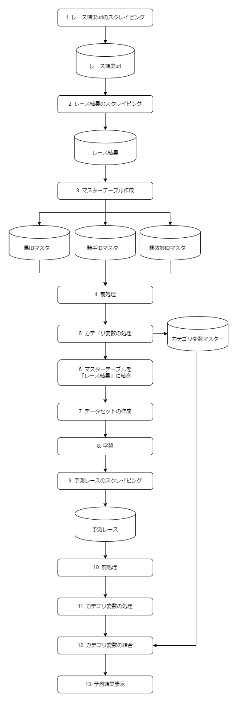

# フローチャート
  

# 詳細
## 1. レース結果urlのスクレイピング
scrapyでレース結果のurlのみをスクレイピング  

## 2. レース結果のスクレイピング
「レース結果url」からurlを取得  
scrapyでレース結果をスクレイピング

## 3. マスターテーブル作成
「レース結果」から「馬IDマスター」「騎手IDマスター」「調教師IDマスター」を作成  
カテゴリ変数の処理に使用する  

## 4. 前処理
「レース結果」を整形
- 欠損値の削除
- 不要な文字列の削除
- 特徴量を追加・削除
- 型変換

## 5. カテゴリ変数の処理
「レース結果」のカテゴリ変数をダミー変数化  
馬名・騎手名・調教師名の処理
- 「馬IDマスター」からラベルエンコーディング
- 「騎手IDマスター」からラベルエンコーディング
- 「調教師IDマスター」からラベルエンコーディング

※ラベルエンコーディングの他に、カウントエンコーディングとダミー変数化の処理を選べる  
　精度とPCスペックの問題で作成するモデルはラベルエンコーディングを採用

## 6. マスターテーブルを「レース結果」に結合
「レース結果」にラベルエンコーディングをしたマスターテーブルを結合  

## 7. データセットの作成
「レース結果」をアンダーサンプリング  
※標準化を行っていたが、LightGBMは決定木のアルゴリズムを使っているため、  
　標準化の意味がなかったので不採用  
「レース結果」を学習データと検証データに7:3で分割  
LightGBMのデータセットを作成  

## 8. 学習
多クラス分類を行うモデルの学習  
モデルは3種類ある  
- multiclass_3：「1着・2着・3着・それ以外」を分類する  
- multiclass_5：「1着・2着・3着・4着・5着・それ以外」を分類する  
- binaryclass：「1着・それ以外」を分類する  
  ※作ってみたけど精度が良くなかったため不採用  

## 9. 予測レースのスクレイピング
scrapyで予測レースをスクレイピング  

## 10. 前処理
「予測レース」を整形
- ブランクを0パディング
- 不要な文字列の削除
- 特徴量を追加・削除
- 型変換

## 11. カテゴリ変数の処理
「予測レース」のcategory変数をダミー変数化  
馬名・騎手名・調教師名の処理
- 「馬IDマスター」からラベルエンコーディング
- 「騎手IDマスター」からラベルエンコーディング
- 「調教師IDマスター」からラベルエンコーディング

※ラベルエンコーディングの他に、カウントエンコーディングとダミー変数化の処理を選べる  
　精度とPCスペックの問題で作成するモデルはラベルエンコーディングを採用

## 12. カテゴリ変数の結合
「カテゴリ変数マスター」を結合  

## 13. 予測結果表示
「1着」の再現率が高いため、「1着」の確率をソートして表示  
