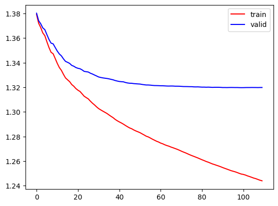
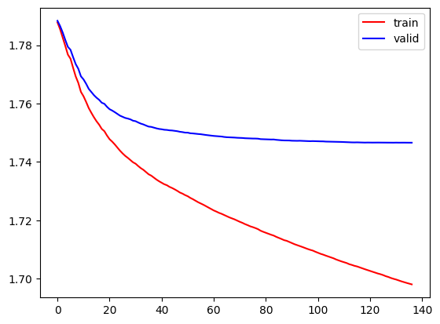
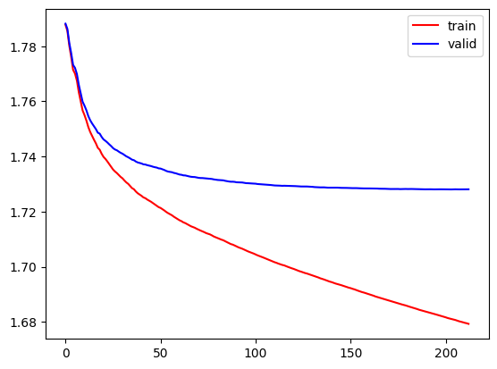

# 採用モデル

|モデル|マスターテーブル処理方法|1着の正解率|1着の再現率|採用|
|-|-|-|-|-|
|多クラス分類(1着・2着・3着・その他)|ラベルエンコーディング|0.33|0.45||
|多クラス分類(1着・2着・3着・その他)|カウントエンコーディング|0.34|0.43||
|多クラス分類(1着・2着・3着・4着・5着・その他)|ラベルエンコーディング|0.28|0.48|〇|
|多クラス分類(1着・2着・3着・4着・5着・その他)|カウントエンコーディング|0.25|0.41||

## 採用理由
採用モデルの正解率は低いが分類数が増えた影響と思われるため、再現率が一番高いモデルを採用  

# 1. 多クラス分類(1着・2着・3着・その他)
## マスターテーブルの処理
|マスターテーブル|処理方法|
|-|-|
|馬IDマスター|ラベルエンコーディング|
|騎手IDマスター|ラベルエンコーディング|
|調教師IDマスター|ラベルエンコーディング|

## 混合配列
```
正解率(accuracy_score):0.33647988584600186
再現率(recall_score):0.33681465209762207
適合率(precision_score):0.3203885696910834
F1値(f1_score):0.31893662969246644
|            |   pred_1着 |   pred_2着 |   pred_3着 |   pred_その他 |
|:-----------|-----------:|-----------:|-----------:|--------------:|
| act_1着    |       4038 |       1792 |       1296 |          1927 |
| act_2着    |       3493 |       1748 |       1504 |          2392 |
| act_3着    |       2915 |       1715 |       1529 |          2974 |
| act_その他 |       1754 |       1195 |       1223 |          4947 |
```

## 分類レポート
```
              precision    recall  f1-score   support

          1着       0.33      0.45      0.38      9053
          2着       0.27      0.19      0.22      9137
          3着       0.28      0.17      0.21      9133
         その他       0.40      0.54      0.46      9119

    accuracy                           0.34     36442
   macro avg       0.32      0.34      0.32     36442
weighted avg       0.32      0.34      0.32     36442
```

# 2. 多クラス分類(1着・2着・3着・その他)
## マスターテーブルの処理
|マスターテーブル|処理方法|
|-|-|
|馬IDマスター|カウントエンコーディング|
|騎手IDマスター|カウントエンコーディング|
|調教師IDマスター|カウントエンコーディング|

## 混合配列
```
正解率(accuracy_score):0.34616126809097175
再現率(recall_score):0.34670692917310253
適合率(precision_score):0.3344257121529828
F1値(f1_score):0.33494171045228127
|            |   pred_1着 |   pred_2着 |   pred_3着 |   pred_その他 |
|:-----------|-----------:|-----------:|-----------:|--------------:|
| act_1着    |       3865 |       1923 |       1469 |          1793 |
| act_2着    |       3216 |       2186 |       1654 |          2066 |
| act_3着    |       2811 |       2027 |       1720 |          2529 |
| act_その他 |       1628 |       1301 |       1301 |          4786 |
```

## 分類レポート
```
              precision    recall  f1-score   support

          1着       0.34      0.43      0.38      9050
          2着       0.29      0.24      0.26      9122
          3着       0.28      0.19      0.23      9087
         その他       0.43      0.53      0.47      9016

    accuracy                           0.35     36275
   macro avg       0.33      0.35      0.33     36275
weighted avg       0.33      0.35      0.33     36275
```

## 学習推移
  

# 3. 多クラス分類(1着・2着・3着・4着・5着・その他)
## マスターテーブルの処理
|マスターテーブル|処理方法|
|-|-|
|馬IDマスター|ラベルエンコーディング|
|騎手IDマスター|ラベルエンコーディング|
|調教師IDマスター|ラベルエンコーディング|

## 混合配列
```
正解率(accuracy_score):0.27801254962223076
再現率(recall_score):0.2780123634779272
適合率(precision_score):0.2738244372147052
F1値(f1_score):0.2608156711720397
|            |   pred_1着 |   pred_2着 |   pred_3着 |   pred_4着 |   pred_5着 |   pred_その他 |
|:-----------|-----------:|-----------:|-----------:|-----------:|-----------:|--------------:|
| act_1着    |       4345 |       1015 |        697 |        758 |        797 |          1462 |
| act_2着    |       2997 |       1745 |        716 |        857 |       1044 |          1730 |
| act_3着    |       2544 |       1025 |       1331 |        919 |       1090 |          2222 |
| act_4着    |       2306 |        981 |        764 |       1480 |       1112 |          2456 |
| act_5着    |       1944 |        978 |        740 |        868 |       1871 |          2721 |
| act_その他 |       1466 |        689 |        639 |        796 |       1133 |          4425 |
```

## 分類レポート
```
              precision    recall  f1-score   support

          1着       0.28      0.48      0.35      9074
          2着       0.27      0.19      0.22      9089
          3着       0.27      0.15      0.19      9131
          4着       0.26      0.16      0.20      9099
          5着       0.27      0.21      0.23      9122
         その他       0.29      0.48      0.37      9148

    accuracy                           0.28     54663
   macro avg       0.27      0.28      0.26     54663
weighted avg       0.27      0.28      0.26     54663
```

## 学習推移
  

# 4. 多クラス分類(1着・2着・3着・4着・5着・その他)
## マスターテーブルの処理
|マスターテーブル|処理方法|
|-|-|
|馬IDマスター|カウントエンコーディング|
|騎手IDマスター|カウントエンコーディング|
|調教師IDマスター|カウントエンコーディング|

## 混合配列
```
正解率(accuracy_score):0.24285871842946952
再現率(recall_score):0.24263301141028148
適合率(precision_score):0.2238668378260825
F1値(f1_score):0.22409499760660037
|            |   pred_1着 |   pred_2着 |   pred_3着 |   pred_4着 |   pred_5着 |   pred_その他 |
|:-----------|-----------:|-----------:|-----------:|-----------:|-----------:|--------------:|
| act_1着    |       3725 |       1411 |        985 |        911 |        744 |          1301 |
| act_2着    |       3000 |       1583 |       1027 |       1003 |        904 |          1484 |
| act_3着    |       2571 |       1483 |        995 |       1134 |       1058 |          1783 |
| act_4着    |       2162 |       1333 |       1039 |       1144 |       1115 |          2189 |
| act_5着    |       1969 |       1194 |       1061 |       1242 |       1246 |          2510 |
| act_その他 |       1197 |        755 |        735 |        904 |        986 |          4519 |
```

## 分類レポート
```
              precision    recall  f1-score   support

          1着       0.25      0.41      0.31      9077
          2着       0.20      0.18      0.19      9001
          3着       0.17      0.11      0.13      9024
          4着       0.18      0.13      0.15      8982
          5着       0.21      0.14      0.16      9222
         その他       0.33      0.50      0.39      9096

    accuracy                           0.24     54402
   macro avg       0.22      0.24      0.22     54402
weighted avg       0.22      0.24      0.22     54402
```

## 学習推移
   


# 5. 多クラス分類(1着・2着・3着・その他)
## マスターテーブルの処理
|マスターテーブル|処理方法|
|-|-|
|馬IDマスター|ダミー変数化|
|騎手IDマスター|ダミー変数化|
|調教師IDマスター|ダミー変数化|

メモリ不足で学習不可

# 6. 多クラス分類(1着・2着・3着・4着・5着・その他)
## マスターテーブルの処理
|マスターテーブル|処理方法|
|-|-|
|馬IDマスター|ダミー変数化|
|騎手IDマスター|ダミー変数化|
|調教師IDマスター|ダミー変数化|

メモリ不足で学習不可

# 7. 二値分類(1着・その他)
混合配列を確認すると全て1着予想になっていたため、不採用  
修正予定