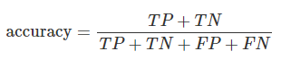
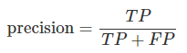
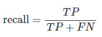
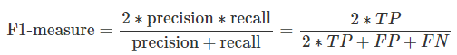

# 二値分類
## 混合行列(Confusion Matrix)とTP, FP, FN, TN
二値分類の正解・不正解の種類は以下の４種類  
TP(True Positive)、FP(False Positive)、FN(False Negative)、TN(True Negative)の4種類  

TP、FP、FN、TNのマトリックスを混合行列(Confusion Matrix)と呼ぶ  

## 混合行列
||実際は正<br>(Positive)|実際は負<br>(Negative)|
|:---|:---|:---|
|予測が正<br>(Positive)|TP(信陽性)<br>True Positive|FP(偽陽性)<br>False Positive<br>第一種の誤り|
|予測が負<br>(Negative)|FN(偽陰性)<br>Flase Negative<br>第二種の誤り|TN(真陰性)<br>True Negative|

- 真陽性（TP: True Positive）: 実際のクラスが陽性で予測も陽性（正解）
- 真陰性（TN: True Negative）: 実際のクラスが陰性で予測も陰性（正解）
- 偽陽性（FP: False Positive）: 実際のクラスは陰性で予測が陽性（不正解）
- 偽陰性（FN: False Negative）: 実際のクラスは陽性で予測が陰性（不正解）

## 正解率(accuracy):accuracy_score()
正解率(accuracy)は、すべてのサンプルのうち正解したサンプルの割合  


関数accuracy_score()で算出できる  
```
from sklearn.metrics import accuracy_score

y_true = [0, 0, 0, 0, 0, 1, 1, 1, 1, 1]
y_pred = [0, 1, 1, 1, 1, 0, 0, 0, 1, 1]

print(accuracy_score(y_true, y_pred))
# 0.3
```

## 適合率(precision):precision_score()
適合率(precision)は、陽性と予測されたサンプルのうち正解したサンプルの割合  


FP(偽陽性)が大きくなると適合率は小さくなる  

```
from sklearn.metrics import precision_score

y_true = [0, 0, 0, 0, 0, 1, 1, 1, 1, 1]
y_pred = [0, 1, 1, 1, 1, 0, 0, 0, 1, 1]

print(precision_score(y_true, y_pred))
# 0.3333333333333333
```

## 再現率(recall):recall_score()
再現率(recall)は実際に陽性のサンプルのうち正解したサンプルの割合  


FN(偽陰性)が大きくなると再現率は小さくなる  

```
from sklearn.metrics import recall_score

y_true = [0, 0, 0, 0, 0, 1, 1, 1, 1, 1]
y_pred = [0, 1, 1, 1, 1, 0, 0, 0, 1, 1]

print(recall_score(y_true, y_pred))
# 0.4
```

## F1値(F1-measure):f1_score()
F1値(F1-measure)は適合率と再現率の調和平均  
F値と呼ばれることもある  


```
from sklearn.metrics import f1_score

y_true = [0, 0, 0, 0, 0, 1, 1, 1, 1, 1]
y_pred = [0, 1, 1, 1, 1, 0, 0, 0, 1, 1]

print(f1_score(y_true, y_pred))
# 0.3636363636363636
```

# 多クラス分類の評価指標

```
from sklearn.metrics import confusion_matrix
from sklearn.metrics import precision_score
from sklearn.metrics import classification_report

y_true_multi = [0, 0, 0, 1, 1, 1, 2, 2, 2]
y_pred_multi = [0, 1, 1, 1, 1, 2, 2, 2, 2]

print(confusion_matrix(y_true_multi, y_pred_multi))
# [[1 2 0]
#  [0 2 1]
#  [0 0 3]]
```

precision_score()などの関数はデフォルトで二値分類を想定しているので、多クラスの配列をy_true, y_predに指定するとエラーになる  

引数averageを指定すると値が算出される  
基本的にはaverage='macro'を指定  
macroはmacro平均  
陽性・陰性を入れ替えて算出した２つの値の算術平均となる  
また、digitsに桁数を指定することで小数点以下を何桁まで表示するか指定できる

```
# print(precision_score(y_true_multi, y_pred_multi))
# ValueError: Target is multiclass but average='binary'. Please choose another average setting.

print(precision_score(y_true_multi, y_pred_multi, average=None))
# [1.   0.5  0.75]

print(precision_score(y_true_multi, y_pred_multi, average='macro'))
# 0.75

print(precision_score(y_true_multi, y_pred_multi, average='micro'))
# 0.6666666666666666

print(precision_score(y_true_multi, y_pred_multi, average='weighted'))
# 0.75
```

